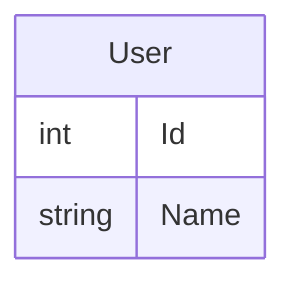

    

<h1> Team project for Bachelor of Engineering degree </h1>
<h3> Backend of an application to support the lives of seniors </h3>
 

## Requirements
### Launching the project
- Docker

### Developing the project
- C# 11
- .NET 7.0
- PostgreSQL 15
- Docker
- Plugin for Mermaid
- Several .Net packages and tools that can be installed via  
`dotnet restore`  
`dotnet tool restore`

## Getting started
1. Clone repository  
`git clone git@github.com:zpi-2023/SensoBackend.git`  
`cd SensoBackend`
2. Run Docker Compose  
`docker-compose up --build`
3. Open swagger at  
`http://localhost:8088/swagger`  
Make sure you are using http instead of https.

## Delivering features in this repository
> ⚠️ The following description is extended to include all common troubleshooting steps. Feel free to skip some steps if you know what you are doing.

1. **Assign yourself** to an issue in this repository
    - All issues should be created from the [project page](https://github.com/orgs/zpi-2023/projects/1)
    - Ensure the issue has specified labels, status and priority
2. Create a new branch, either by
    - **(or)** `git checkout -b <branch-name>` from an up-to-date `main` branch
    - **(or)** Going to the issue, and clicking "Create new branch" in the "Development" section in the sidebar
3. Ensure you are using the the correct .NET version: `dotnet --version`
4. Ensure you are using up-to-date dependencies: `dotnet restore`
5. Ensure you are using up-to-date tools: `dotnet tool restore`
6. Ensure you installed husky: `dotnet husky install`
7. Develop your feature
    - Move your task to the **"In Progress"** column
    - Make sure to add test coverage whenever possible
    - Check that you did not violate any conventions with `dotnet csharpier --check .`
    - Make sure that all tests are passing with `dotnet test`
    - Make sure that db diagram in README is up-to-date
8. Commit your changes
    - Husky.Net should ensure that your commit does not violate any coding conventions
    - Feel free to add multiple commits to your feature, they will get squashed anyway
9. Create a PR
    - Move your task to the **"In Review"** column
    - Notify the team that your change is pending review
    - Feel free to create the PR before finishing and include "DRAFT" in its name
10. Make sure your PR is ready to merge
    - **Wait for at least one review from another team member**
    - Wait for all CI actions to pass successfully
11. Squash and merge! 🚀

## Current DB Diagram

